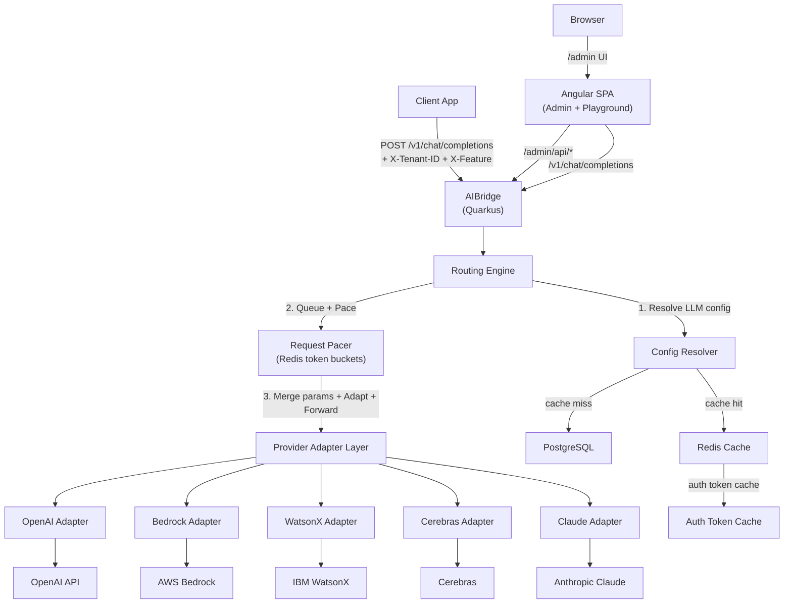
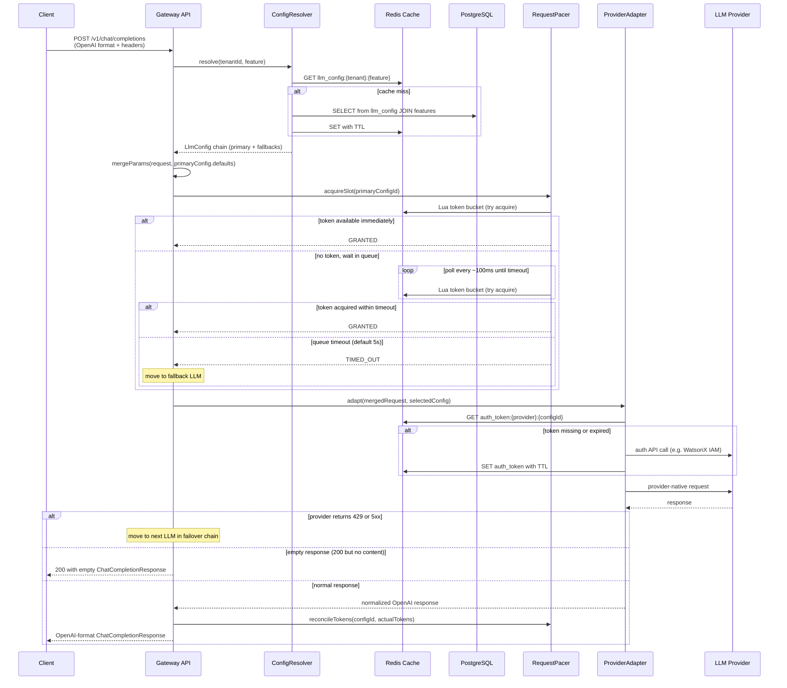
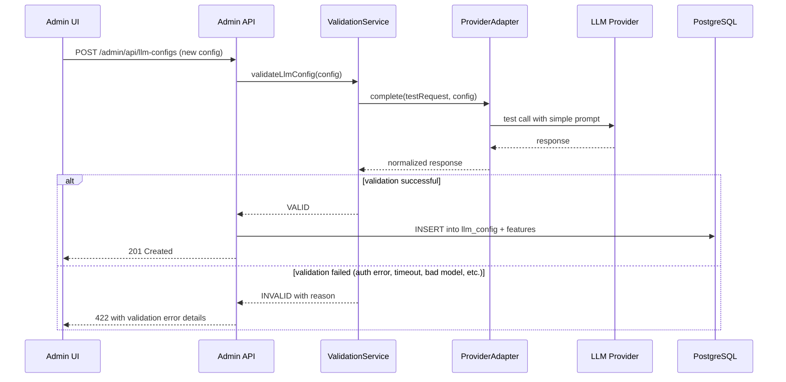
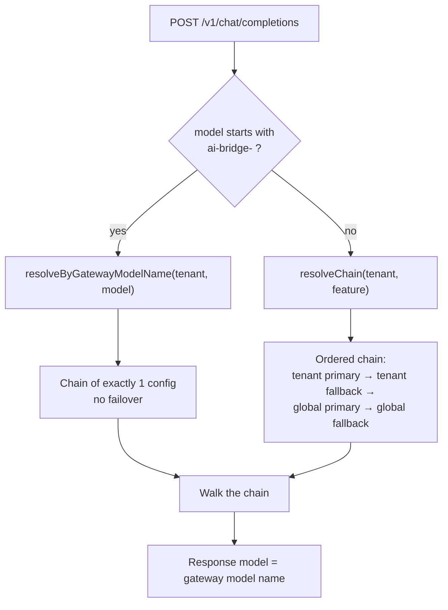
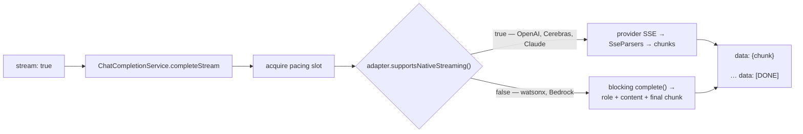
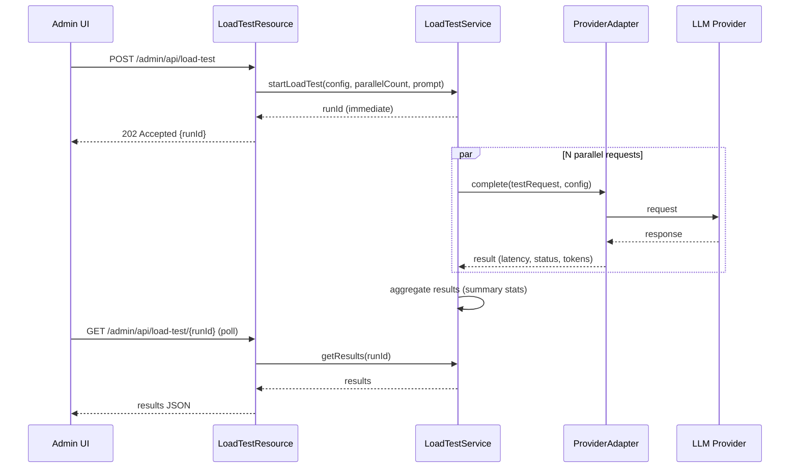

# AIBridge — Architecture & Detailed Plan


## 1. High-Level Architecture



## 2. Request Flow (Non-Streaming, Queue-Based Pacing)



### Failover Triggers (what causes the gateway to try the next LLM):

1. **Queue timeout** — request waited > `queue_timeout_ms` (default 5000ms) for a pacing slot
2. **Provider 429** — the actual LLM provider returned HTTP 429
3. **Provider 5xx / timeout** — the LLM provider is down or unresponsive

The failover chain is walked in order. If ALL LLMs in the chain are exhausted (all timed out or all returned errors), the gateway returns **502 Bad Gateway** to the caller.

## 3. Admin LLM Validation Flow



When an admin adds or updates an LLM config, the system first does a test call to the LLM provider with a simple prompt (e.g. "Say hello"). Only if the provider responds successfully is the config persisted to the database.

## 3b. Gateway Model Identity & Routing

Each `llm_config` row carries a service-wide unique name assigned on create:

```
ai-bridge-<sequence>-<slugified model_name>
```

`slugify` lowercases and replaces every run of non-alphanumeric characters with `-`, so
`meta-llama/Llama-3 8B` becomes `meta-llama-llama-3-8b`. The sequence counts up **per slug**, not
per raw model name, so two names that normalise identically cannot collide.

This is what removes the old `UNIQUE(tenant_id, model_name, is_fallback)` limit: the same underlying
model can now be registered any number of times, each instance addressable on its own.



**Sequence allocation.** `LlmConfigRepository.nextSequenceForSlug` takes a transaction-scoped
Postgres advisory lock keyed on the slug, then reads `MAX(model_sequence)` for that slug. The unique
index on `(model_slug, model_sequence)` is the hard guarantee if the lock is ever bypassed.

**Re-assignment.** Updating a config only re-derives the name when the model name normalises to a
different slug. An unrelated edit (rate limit, credentials, features) leaves the name untouched, so
clients pinning it are not broken.

**Tenant isolation.** A gateway model name is globally unique, but a tenant may only address its own
configs and the global ones. Naming another tenant's config returns 404, indistinguishable from a
name that does not exist.

**Discovery.** `GET /v1/models` returns the OpenAI list envelope scoped to the caller's tenant plus
globals, so unmodified OpenAI SDKs can enumerate the gateway.

## 3c. Request Lineage

Every completion accumulates a `CompletionLineage` as it walks the chain — one `CallAttempt` per
config touched, carrying the gateway model name, provider, outcome, wall-clock duration and the
prompt/completion/total tokens that attempt consumed.

| Outcome | Terminal? |
|---------|-----------|
| `SUCCESS` | yes |
| `EMPTY_RESPONSE` | yes — returned as 200 |
| `QUEUE_TIMEOUT` | no — advances the chain |
| `RATE_LIMITED` | no — advances the chain |
| `UNAVAILABLE` | no — advances the chain |
| `NO_ADAPTER` | no — advances the chain |
| `ERROR` | yes — recorded, logged and rethrown, never failed over |

`ERROR` covers anything that is a misconfiguration or a bug rather than a provider outage — a bad
encryption key, malformed credentials JSON. Those fail identically on every config in the chain, so
failing over would only bury the cause. The attempt is recorded, the lineage is logged, and the
exception is rethrown.

The lineage is always logged as one line alongside the `X-Request-ID`, including on chain
exhaustion, where the caller only sees a 502. It reaches the response body as `x_aibridge_lineage`
only when the request carries `X-Include-Lineage: true`, so the default payload stays a clean
OpenAI response.

`billed_total_tokens` sums every attempt rather than only the successful one, so tokens burned by a
provider that later failed over remain visible.

## 3d. Streaming

`"stream": true` switches the response to `text/event-stream` in the OpenAI wire format: one
`data:` line per `chat.completion.chunk`, terminated by `data: [DONE]`.



**Two protocols, one output.** `SseParsers` is deliberately free of I/O — it takes the raw SSE
lines a provider emitted and returns chunks, so each translation is tested against recorded
provider output with no network call.

- *OpenAI-compatible* frames are already the target shape; the only work is re-stamping `model`
  with the gateway name and stopping at the sentinel.
- *Anthropic* frames are a different shape entirely — `message_start`, `content_block_delta`
  carrying `delta.text`, `message_delta` with the stop reason and output tokens. Stop reasons are
  mapped into OpenAI's vocabulary (`max_tokens` → `length`, `tool_use` → `tool_calls`).

A malformed frame is skipped rather than failing the stream: providers emit keep-alive comments and
blank lines, and one unparseable frame should not discard tokens the client already has.

**Failover boundary.** Failover covers *establishing* the stream — acquiring a pacing slot and
getting the provider to start answering. Once the first chunk reaches the client, bytes are on the
wire and there is no honest way to switch providers, so a mid-stream failure ends the stream.

**Token accounting.** `usage` rides on the terminating chunk, so a streaming attempt only learns
its token count once the client drains the stream. The lineage's `billedTotalTokens` is therefore
derived from the attempts on read rather than accumulated on write.

## 4. Standardized API Contract (OpenAI Chat Completions Format)

### 4.1 Request (Input)

The gateway exposes: `POST /v1/chat/completions`

**Headers:**
- `X-Tenant-ID` (optional) — if absent, uses default (tenant_id=null) config
- `X-Feature` (required) — the feature name for routing
- `Content-Type: application/json`

**Body (OpenAI-compatible):**

```json
{
  "messages": [
    { "role": "system", "content": "You are a helpful assistant." },
    { "role": "user", "content": "Hello!" }
  ],
  "temperature": 0.7,
  "max_tokens": 1024,
  "top_p": 1.0,
  "n": 1,
  "stop": ["\n"],
  "presence_penalty": 0,
  "frequency_penalty": 0
}
```

**Parameter resolution (payload overrides DB defaults):**
- `messages` is **required** — always provided by client.
- All other parameters (`temperature`, `max_tokens`, `top_p`, `n`, `stop`, `presence_penalty`, `frequency_penalty`) are **optional in the payload**.
- If provided in the payload, the payload value is used.
- If omitted, the DB-stored default for that LLM config is used.
- If also null in DB, the parameter is omitted entirely (LLM provider uses its own default).
- `model` is resolved from DB (`llm_config.model_name`) — not sent by the client.

### 4.2 Response (Non-Streaming)

```json
{
  "id": "chatcmpl-xyz",
  "object": "chat.completion",
  "created": 1234567890,
  "model": "resolved-model-name",
  "choices": [
    {
      "index": 0,
      "message": { "role": "assistant", "content": "Hello! How can I help?" },
      "finish_reason": "stop"
    }
  ],
  "usage": {
    "prompt_tokens": 12,
    "completion_tokens": 8,
    "total_tokens": 20
  }
}
```

### 4.3 Empty Response Handling

Some LLM providers may return HTTP 200 with an empty or malformed response body. The gateway handles this gracefully:

```json
{
  "id": "chatcmpl-empty",
  "object": "chat.completion",
  "created": 1234567890,
  "model": "resolved-model-name",
  "choices": [
    {
      "index": 0,
      "message": { "role": "assistant", "content": "" },
      "finish_reason": "stop"
    }
  ],
  "usage": {
    "prompt_tokens": 0,
    "completion_tokens": 0,
    "total_tokens": 0
  }
}
```

Returns HTTP **200** with an empty content field — never throws on empty provider responses.

## 5. Database Schema (PostgreSQL)

### 5.1 `llm_provider` — Master table for provider types

- `id` — UUID PK
- `name` — VARCHAR, e.g. "openai", "bedrock", "watsonx", "cerebras", "claude"
- `auth_type` — VARCHAR, one of: `API_KEY`, `IAM_TOKEN`, `AWS_SIGV4`, `OAUTH2`
- `auth_endpoint` — VARCHAR (nullable), e.g. WatsonX IAM token URL
- `created_at` — TIMESTAMP
- `updated_at` — TIMESTAMP

### 5.2 `llm_config` — Core configuration table

- `id` — UUID PK
- `tenant_id` — TEXT (nullable), NULL = global/default config
- `provider_id` — FK -> llm_provider
- `model_name` — VARCHAR, e.g. "gpt-4o", "meta-llama/llama-3-8b-instruct"
- `endpoint_url` — VARCHAR, full provider URL
- `credentials_encrypted` — TEXT, AES-256 encrypted JSON blob
- `rps_limit` — INTEGER (nullable), requests per second
- `rpm_limit` — INTEGER (nullable), requests per minute
- `tpm_limit` — INTEGER (nullable), tokens per minute
- `default_temperature` — DOUBLE PRECISION (nullable)
- `default_max_tokens` — INTEGER (nullable)
- `default_top_p` — DOUBLE PRECISION (nullable)
- `default_n` — INTEGER (nullable)
- `default_stop` — TEXT[] (nullable)
- `default_presence_penalty` — DOUBLE PRECISION (nullable)
- `default_frequency_penalty` — DOUBLE PRECISION (nullable)
- `queue_timeout_ms` — INTEGER default 5000, how long a request waits in the pacing queue before triggering failover
- `is_fallback` — BOOLEAN default false
- `priority` — INTEGER default 0 (lower = higher priority)
- `extra_params` — JSONB (nullable), provider-specific (e.g. WatsonX project_id, Bedrock region)
- `is_active` — BOOLEAN default true
- `created_at` — TIMESTAMP
- `updated_at` — TIMESTAMP

- `model_slug` — VARCHAR, normalised form of `model_name` (added in V2)
- `model_sequence` — INTEGER, counts up per slug (added in V2)
- `gateway_model_name` — VARCHAR, `ai-bridge-<sequence>-<slug>`, unique service-wide (added in V2)

**Unique constraints:** `UNIQUE(gateway_model_name)` and `UNIQUE(model_slug, model_sequence)`.

> **Changed in V2.** The original `UNIQUE(tenant_id, model_name, is_fallback)` index capped a tenant
> at two rows per model name (one primary, one fallback) and is dropped by
> `V2__gateway_model_name.sql`. Identity now lives on the gateway model name, so the same model can
> be registered as many times as needed.

### 5.3 `features` — Feature-to-config mapping

- `id` — UUID PK
- `llm_config_id` — FK -> llm_config (ON DELETE CASCADE)
- `feature` — VARCHAR, e.g. "summarization", "chat", "code-gen"

**Unique constraint:** `UNIQUE(llm_config_id, feature)`

**Lookup index:** Composite index on `(feature)` for fast resolution queries.

**Resolution logic** for `(tenant_id=T, feature=F)`:
1. `tenant_id=T, feature=F, is_fallback=false, is_active=true` ORDER BY priority — primary
2. `tenant_id=T, feature=F, is_fallback=true, is_active=true` — tenant fallback
3. `tenant_id IS NULL, feature=F, is_fallback=false, is_active=true` — global primary
4. `tenant_id IS NULL, feature=F, is_fallback=true, is_active=true` — global fallback
5. Return 404 / error if nothing found

### 5.4 Redis Keys (not in Postgres)

- **Config cache:** `llm_config:{tenantId}:{feature}` — TTL 5 min, invalidated on admin CRUD
- **Auth token cache:** `auth_token:{providerId}:{configId}` — TTL = token expiry minus buffer
- **Token buckets (pacing):**
  - `tokenbucket:{configId}:rps` — hash: `{tokens, last_refill}`, TTL 120s
  - `tokenbucket:{configId}:rpm` — hash: `{tokens, last_refill}`, TTL 120s
  - `tokenbucket:{configId}:tpm` — hash: `{tokens, last_refill}`, TTL 120s

## 6. Project Structure

```
aibridge/
  docker-compose.yml                   # Postgres + Redis (for docker runs)
  pom.xml
  frontend/                            # Angular app (conditionally built)
    angular.json
    package.json
    src/
      app/
        admin/                         # Admin module
          components/
            llm-config-list/
            llm-config-form/
            llm-provider-list/
            llm-provider-form/
            load-test/                 # Load test page
          services/
            admin-api.service.ts
            load-test-api.service.ts
          admin.module.ts
          admin-routing.module.ts
        playground/                    # Homepage playground
          components/
            chat-playground/
          services/
            playground-api.service.ts
          playground.module.ts
        shared/
          models/                      # TypeScript interfaces
          components/
            health-status/
        app.component.ts
        app-routing.module.ts
  src/
    main/
      java/com/aibridge/
        config/
          EncryptionConfig.java
          RedisConfig.java
          AiBridgeConfig.java          # ui.required, aibridge.queue.*, etc.
        model/                         # JPA entities
          LlmProvider.java
          LlmConfig.java
          Feature.java
          enums/
            AuthType.java
            ProviderName.java
        dto/
          openai/                      # OpenAI-format DTOs
            ChatCompletionRequest.java
            ChatCompletionResponse.java
            ChatMessage.java
            Choice.java
            Usage.java
          admin/                       # Admin request/response DTOs
            LlmConfigRequest.java
            LlmConfigResponse.java
            LlmProviderRequest.java
            LlmProviderResponse.java
            ValidationResultResponse.java
          loadtest/                    # Load test DTOs
            LoadTestRequest.java
            LoadTestResponse.java
            LoadTestResultItem.java
            LoadTestSummary.java
        repository/
          LlmProviderRepository.java
          LlmConfigRepository.java
          FeatureRepository.java
        service/
          ConfigResolverService.java
          RequestPacingService.java    # Redis distributed token bucket + queue-and-wait
          EncryptionService.java
          ChatCompletionService.java
          LlmValidationService.java   # Test-call before DB persist
          ParameterMergeService.java   # Merge payload + DB defaults
          LoadTestService.java         # Parallel stress test executor + result aggregation
        adapter/
          LlmProviderAdapter.java     # Interface
          OpenAiAdapter.java
          BedrockAdapter.java
          WatsonXAdapter.java
          CerebrasAdapter.java
          ClaudeAdapter.java
          auth/
            AuthTokenManager.java
        resource/
          ChatCompletionResource.java  # POST /v1/chat/completions
          AdminLlmConfigResource.java  # /admin/api/llm-configs
          AdminLlmProviderResource.java # /admin/api/llm-providers
          AdminFeatureResource.java    # /admin/api/features
          LoadTestResource.java        # /admin/api/load-test
          HealthResource.java          # /health (custom, beyond SmallRye)
        filter/
          SecurityHeadersFilter.java     # Adds X-Content-Type-Options, CSP, etc.
          RequestCorrelationFilter.java  # Generates/propagates X-Request-ID
          EndpointUrlValidator.java      # SSRF prevention: allowlist + private IP block
        exception/
          QueueTimeoutException.java
          ProviderUnavailableException.java
          ProviderRateLimitException.java
          EmptyLlmResponseException.java
          LlmValidationException.java
          EncryptionException.java
          ConfigNotFoundException.java
          GlobalExceptionMapper.java
      resources/
        application.properties         # Multi-profile: %dev, %docker, %prod
        db/migration/
          V1__init_schema.sql
    test/
      java/com/aibridge/
        service/
          ConfigResolverServiceTest.java
          RequestPacingServiceTest.java
          EncryptionServiceTest.java
          ChatCompletionServiceTest.java
          LlmValidationServiceTest.java
          ParameterMergeServiceTest.java
          LoadTestServiceTest.java
        adapter/
          OpenAiAdapterTest.java
          WatsonXAdapterTest.java
          BedrockAdapterTest.java
          ClaudeAdapterTest.java
          CerebrasAdapterTest.java
        resource/
          ChatCompletionResourceTest.java
          AdminLlmConfigResourceTest.java
          AdminLlmProviderResourceTest.java
```

## 7. Running Modes (Docker vs Non-Docker)

### 7.1 application.properties (multi-profile)

```properties
# --- Default / Dev (IntelliJ, no Docker) ---
quarkus.datasource.db-kind=postgresql
quarkus.datasource.jdbc.url=jdbc:postgresql://localhost:5432/aibridge
quarkus.datasource.username=postgres
quarkus.datasource.password=postgres
quarkus.redis.hosts=redis://localhost:6379

# --- Docker profile ---
%docker.quarkus.datasource.jdbc.url=jdbc:postgresql://postgres:5432/aibridge
%docker.quarkus.redis.hosts=redis://redis:6379

# --- UI toggle ---
ui.required=true
```

### 7.2 docker-compose.yml

Provides Postgres, Redis, and optionally the gateway itself:

- `postgres` service (port 5432)
- `redis` service (port 6379)
- `aibridge` service (port 8080, profile=docker) — optional, for full-docker run

### 7.3 Run from IntelliJ

- Start Postgres + Redis locally (or via `docker-compose up postgres redis`)
- Run the Quarkus main class from IntelliJ with default profile
- Flyway auto-migrates on startup
- Angular dev server: `cd frontend && ng serve` (proxies API calls to localhost:8080)

### 7.4 Conditional UI Build

When `ui.required=true`:
- Maven `frontend-maven-plugin` runs `ng build` during `mvn package`
- Angular output goes to `src/main/resources/META-INF/resources/`
- Quarkus serves the SPA at `/` (homepage = playground) and `/admin` (admin UI)

When `ui.required=false`:
- Frontend build is skipped entirely
- Only REST APIs are available

## 8. Key Design Decisions

### 8.1 Parameter Merging (Payload overrides DB Defaults)

Before forwarding to any adapter, `ParameterMergeService` merges:

```
for each optional param (temperature, max_tokens, top_p, n, stop, presence_penalty, frequency_penalty):
    if request.param != null  ->  use request.param
    else if dbConfig.default_param != null  ->  use dbConfig.default_param
    else  ->  omit (let the LLM provider use its own default)
```

The `model` is always resolved from DB (`llm_config.model_name`). Routing is determined by `(tenant_id, feature)`, not by any model field in the request payload.

### 8.2 Provider Adapter Pattern (Strategy)

Each provider implements:

```java
public interface LlmProviderAdapter {
    ProviderName getProviderName();
    ChatCompletionResponse complete(ChatCompletionRequest request, LlmConfig config);
}
```

Non-streaming only for Phase 1. Streaming (`Multi<ChatCompletionChunk> completeStream(...)`) will be added in Phase 2.

- **OpenAI / Cerebras**: Near pass-through (OpenAI-compatible). Swap base URL + auth.
- **Claude (Anthropic)**: Map messages format, extract system prompt to separate field.
- **WatsonX**: Map to `/ml/v1/text/chat`, add `project_id`, use IAM token from `AuthTokenManager`.
- **Bedrock**: Use Converse API format, AWS SigV4 signing.

Adapter selection via `Map<ProviderName, LlmProviderAdapter>` CDI bean.

### 8.3 Queue-Based Rate Pacing with Redis (Distributed Token Bucket)

Instead of rejecting requests that exceed the rate limit, the gateway **queues** them and dispatches at the provider's allowed rate. This is implemented as a **distributed token bucket** in Redis.

**How the Token Bucket Works:**

Each LLM config gets up to 3 independent buckets (only for non-null limits):

- **RPS bucket**: capacity = `rps_limit`, refill rate = `rps_limit` tokens/second
- **RPM bucket**: capacity = `rpm_limit`, refill rate = `rpm_limit` tokens/minute
- **TPM bucket**: capacity = `tpm_limit`, refill rate = `tpm_limit` tokens/minute

**Redis Keys:**

- `tokenbucket:{configId}:rps` — hash with fields: `tokens`, `last_refill_ts`
- `tokenbucket:{configId}:rpm` — hash with fields: `tokens`, `last_refill_ts`
- `tokenbucket:{configId}:tpm` — hash with fields: `tokens`, `last_refill_ts`

**Lua Script (atomic try-acquire):**

```
-- Called for each request. Returns: 1 = granted, 0 = no token available
local key = KEYS[1]
local capacity = tonumber(ARGV[1])      -- e.g. 10 for RPS
local refill_rate = tonumber(ARGV[2])   -- tokens per second
local now = tonumber(ARGV[3])           -- current epoch timestamp in ms

local data = redis.call('HMGET', key, 'tokens', 'last_refill')
local tokens = tonumber(data[1]) or capacity   -- start full
local last_refill = tonumber(data[2]) or now

-- Refill based on elapsed time
local elapsed = (now - last_refill) / 1000.0   -- seconds
local refill = math.min(capacity, tokens + (elapsed * refill_rate))

if refill >= 1 then
    redis.call('HMSET', key, 'tokens', refill - 1, 'last_refill', now)
    redis.call('EXPIRE', key, 120)
    return 1  -- GRANTED
else
    redis.call('HMSET', key, 'tokens', refill, 'last_refill', now)
    redis.call('EXPIRE', key, 120)
    return 0  -- NO TOKEN
end
```

**Queue-and-Wait Flow (Java side):**

```
Uni<Void> acquireSlot(configId, timeout):
    loop:
        result = redis.eval(luaScript, rps_key, rps_limit, rps_rate, now)
        if result == GRANTED:
            also check rpm_key and tpm_key (same pattern)
            if all granted -> return success
        wait 50-100ms (adaptive backoff)
        if elapsed > queue_timeout_ms -> throw QueueTimeoutException
```

The request **blocks** (non-blocking in Mutiny terms — it's a delayed `Uni`) until either a token is available or the queue timeout expires. On timeout, the `ChatCompletionService` moves to the next LLM in the failover chain.

**TPM Post-Call Reconciliation:**

After the LLM responds, deduct actual tokens from the TPM bucket:
```
HINCRBY tokenbucket:{configId}:tpm tokens -{actual_total_tokens}
```

**Why Distributed (Redis) Instead of In-Memory:**

Multiple gateway instances behind a load balancer all share the same Redis buckets. If instance A admits 6 requests/sec and instance B admits 4 requests/sec, the provider sees exactly 10 RPS total — not 10 from each.

**Configuration (application.properties):**

```properties
aibridge.queue.timeout-ms=5000          # default 5 seconds
aibridge.queue.poll-interval-ms=50     # how often to retry acquire
```

Both are configurable per-environment.

### 8.4 Credential Encryption

- AES-256-GCM, key in `application.properties` (or Vault/K8s secret in prod).
- `EncryptionService` encrypts on save, decrypts on read.
- Flexible JSON blob per provider:
  - OpenAI: `{"api_key": "sk-..."}`
  - Bedrock: `{"aws_access_key": "...", "aws_secret_key": "...", "region": "us-east-1"}`
  - WatsonX: `{"api_key": "...", "project_id": "..."}`

### 8.5 Failover Chain

Resolution order for `(tenantId=T, feature=F)`:

1. `tenant_id=T, feature=F, is_fallback=false` — primary tenant LLM
2. `tenant_id=T, feature=F, is_fallback=true` — tenant fallback LLM
3. `tenant_id=NULL, feature=F, is_fallback=false` — global primary
4. `tenant_id=NULL, feature=F, is_fallback=true` — global fallback
5. **404** if none configured at all; **502** if all failed

**What triggers moving to the next LLM in the chain:**

- **Queue timeout**: request waited > `queue_timeout_ms` in the pacing queue (the current LLM is too busy)
- **Provider 429**: the actual LLM provider rate-limited us
- **Provider 5xx / connection timeout**: the LLM provider is down

**What does NOT trigger failover:**

- Normal queue wait (request waits 2s out of 5s allowed — this is fine, keep waiting)
- Provider returns 200 with empty body (this is handled gracefully, not a failover trigger)

When moving to a fallback LLM, the request goes through the same queue-and-wait cycle for that LLM's rate limits. Each LLM in the chain has its own independent token buckets.

### 8.6 Empty Response Handling

When an LLM provider returns HTTP 200 with empty/null body:
- Do NOT throw an exception.
- Return HTTP 200 to the caller with an empty `ChatCompletionResponse` (empty content string, zero token usage).
- Log a warning for observability.

### 8.7 LLM Validation on Admin Save

When creating or updating an `llm_config` via the admin API:
1. `LlmValidationService` decrypts credentials and builds a test request: `messages: [{"role": "user", "content": "Say hello"}]`
2. Calls the appropriate adapter's `complete()` method.
3. If the provider returns a valid response (even empty), validation passes -> persist to DB.
4. If the call fails (auth error, network timeout, invalid model, etc.), return **422 Unprocessable Entity** with the error details. Nothing is written to DB.

## 9. Exception Handling Strategy

All exceptions are caught by `GlobalExceptionMapper` and converted to a consistent JSON error body:

```json
{
  "error": {
    "type": "rate_limit_exceeded",
    "message": "RPM limit (60) exceeded for config abc-123",
    "status": 429
  }
}
```

Exception types and their HTTP mappings:

- `ConfigNotFoundException` -> **404** (no LLM configured for tenant+feature)
- `QueueTimeoutException` -> **internal, not surfaced** (caught by ChatCompletionService, triggers fallback to next LLM in chain)
- `ProviderRateLimitException` -> **internal, not surfaced** (provider returned 429; caught by ChatCompletionService, triggers fallback)
- `ProviderUnavailableException` -> **502** (all LLMs in failover chain failed — provider 5xx / timeout / 429 after exhausting all fallbacks)
- `LlmValidationException` -> **422** (admin flow: test call failed)
- `EncryptionException` -> **500** (credential decrypt failure)
- `EmptyLlmResponseException` -> **NOT THROWN** (handled gracefully as 200 with empty content)
- Any unexpected exception -> **500** with generic message (details logged server-side)

Note: `QueueTimeoutException` and `ProviderRateLimitException` are **never returned to the caller directly**. They are caught internally by `ChatCompletionService` and trigger the failover chain. Only if ALL LLMs in the chain are exhausted does the caller see a **502**.

## 10. Admin REST API

- `GET    /admin/api/llm-providers` — list all providers
- `POST   /admin/api/llm-providers` — create provider
- `PUT    /admin/api/llm-providers/{id}` — update provider
- `DELETE /admin/api/llm-providers/{id}` — delete provider
- `GET    /admin/api/llm-configs` — list all configs (filterable by tenant, feature, provider)
- `GET    /admin/api/llm-configs/{id}` — get single config (credentials masked)
- `POST   /admin/api/llm-configs` — create config (validates LLM first, then persists)
- `PUT    /admin/api/llm-configs/{id}` — update config (re-validates, invalidates Redis cache)
- `DELETE /admin/api/llm-configs/{id}` — soft-delete / deactivate (invalidates Redis cache)
- `POST   /admin/api/llm-configs/test` — test an LLM config without saving (dry-run validation)
- `GET    /admin/api/features` — list all features
- `POST   /admin/api/load-test` — start a load test run (returns 202 with runId)
- `GET    /admin/api/load-test/{runId}` — poll load test status and results
- `GET    /admin/api/load-test` — list recent test runs
- `GET    /admin/api/health` — detailed health (DB + Redis connectivity, per-provider status)

Admin API is under `/admin/api/*` to avoid collision with the Angular SPA route at `/admin`.

## 11. Angular UI

### 11.1 Routes

- `/` — **Playground homepage**: select a configured LLM (dropdown of active configs), type a prompt, see the response. Acts as a quick test/demo tool.
- `/admin` — **Admin dashboard**: lists LLM configs, providers, features with CRUD actions.
- `/admin/llm-configs/new` — Create new LLM config form (with "Test Connection" button).
- `/admin/llm-configs/:id/edit` — Edit existing config.
- `/admin/llm-providers` — Manage providers.
- `/admin/load-test` — **Load testing**: select an LLM, set parallel count, run stress test, view per-request results in scrollable table.
- `/admin/health` — Health dashboard showing DB, Redis, and per-provider connectivity status.

### 11.2 Key UI Behaviors

- **Validation-on-save**: The "Save" button on config forms first calls `POST /admin/api/llm-configs/test`, shows a spinner, then on success calls the actual create/update endpoint. On failure, shows the error inline.
- **Playground**: Dropdown lists all active `llm_config` entries. Selecting one pre-fills the model name and defaults. User types a message, hits Send, response appears below. Uses `POST /v1/chat/completions` with the appropriate headers.
- **Health page**: Polls `/admin/api/health` and shows green/red status for each component.

## 12. Health Check

- **SmallRye Health** (`/q/health`) for standard liveness/readiness probes.
- **Custom `/admin/api/health`** endpoint returning detailed JSON:
  - `database`: connection status + latency
  - `redis`: connection status + latency
  - `providers`: for each active `llm_config`, last-known status (populated from validation results and runtime errors)
- The Angular health page consumes this endpoint and shows a dashboard.

## 13. Load Testing (Built-in Locust-Style)

A built-in load testing feature that lets admins stress-test any configured LLM directly from the UI.

### 13.1 Load Test API

- `POST /admin/api/load-test` — start a load test (async, returns a test run ID immediately)
- `GET  /admin/api/load-test/{runId}` — poll status and results
- `GET  /admin/api/load-test` — list recent test runs

**Request body for POST:**

```json
{
  "llm_config_id": "uuid-of-the-llm-config",
  "parallel_requests": 100,
  "prompt": "What is 2+2?",
  "max_tokens": 50
}
```

**Response for GET (results):**

```json
{
  "run_id": "uuid",
  "status": "COMPLETED",
  "llm_config_id": "uuid",
  "model_name": "gpt-4o",
  "parallel_requests": 100,
  "started_at": "2026-04-11T10:00:00Z",
  "completed_at": "2026-04-11T10:00:12Z",
  "summary": {
    "total": 100,
    "success": 93,
    "failed": 7,
    "avg_latency_ms": 1250,
    "p50_latency_ms": 1100,
    "p95_latency_ms": 2800,
    "p99_latency_ms": 3500,
    "max_latency_ms": 4200,
    "min_latency_ms": 450
  },
  "results": [
    {
      "request_index": 1,
      "status": "SUCCESS",
      "latency_ms": 1100,
      "http_status": 200,
      "tokens_used": 18,
      "error": null
    },
    {
      "request_index": 2,
      "status": "FAILED",
      "latency_ms": 5000,
      "http_status": 429,
      "tokens_used": 0,
      "error": "Rate limit exceeded by provider"
    }
  ]
}
```

### 13.2 Backend Flow



**Key implementation details:**

- Load tests run **asynchronously** — the POST returns `202 Accepted` with a `runId` immediately. The UI polls for results.
- All N requests are fired **truly in parallel** using Java's `CompletableFuture.allOf()` or Mutiny's `Uni.join().all()`.
- Each request goes through the **adapter directly** (bypasses the pacing queue — this is a stress test, we intentionally want to hit the provider hard to see what happens).
- Per-request timing uses `System.nanoTime()` for accurate latency measurement.
- Results are stored **in-memory** (ConcurrentHashMap keyed by runId, with TTL-based eviction after 1 hour). No need to persist test results to DB.
- **Max parallel requests cap**: Configurable via `aibridge.load-test.max-parallel=500` to prevent the gateway itself from being DOSed by a test.
- **Status values**: `PENDING`, `RUNNING`, `COMPLETED`, `FAILED`

### 13.3 Angular Load Test UI

**Route:** `/admin/load-test`

**Layout:**

- **Top section**: LLM config dropdown (populated from active configs), number input for parallel requests, text area for test prompt, "Run Test" button
- **Progress indicator**: While running, shows a progress bar or spinner with "Running... X/N complete"
- **Summary cards**: After completion, shows cards for: Total, Success, Failed, Avg Latency, P95 Latency, P99 Latency
- **Results table** (scrollable): One row per request, columns:
  - `#` (request index)
  - `Status` (green checkmark for success, red X for failure)
  - `Latency (ms)` (color-coded: green < 1s, yellow 1-3s, red > 3s)
  - `HTTP Status`
  - `Tokens Used`
  - `Error` (shown if failed, truncated with tooltip for full message)
- Table has **virtual scroll** for large result sets (100+ rows) — Angular CDK `cdk-virtual-scroll-viewport` to avoid DOM bloat
- **Export**: Button to download results as CSV

## 14. Technology Stack

- **Quarkus 3.x** (RESTEasy Reactive, Hibernate ORM with Panache, REST Client)
- **Java 17+**
- **PostgreSQL** (via `quarkus-jdbc-postgresql` + Hibernate ORM)
- **Redis** (via `quarkus-redis-client`)
- **Flyway** (DB migrations)
- **Angular 17+** (frontend, conditionally built)
- **Jackson** (JSON serialization)
- **JUnit 5 + Mockito** (unit testing only)
- **frontend-maven-plugin** (builds Angular during Maven package)

## 14. Security Hardening (Zero Vulnerability Target)

### 14.1 Input Validation and Sanitization

- **All incoming DTOs validated** using Jakarta Bean Validation (`@NotNull`, `@NotBlank`, `@Size`, `@Min`, `@Max`) on every field of `ChatCompletionRequest`, admin DTOs, etc.
- **Message content sanitization**: Strip or reject control characters, null bytes, and excessively long messages. Enforce a max `messages` array size and max `content` length per message.
- **Header validation**: `X-Tenant-ID` and `X-Feature` validated against allowed character patterns (alphanumeric + hyphens only, regex `^[a-zA-Z0-9_-]+$`). Reject anything else to prevent header injection.
- **Path/query parameter validation**: UUIDs validated as proper UUID format. No raw string concatenation into SQL or Redis commands.
- **Request body size limit**: Enforce max body size via `quarkus.http.limits.max-body-size` (e.g., 1MB) to prevent memory exhaustion attacks.

### 14.2 SQL Injection Prevention

- **Hibernate ORM with Panache** uses parameterized queries exclusively. No raw SQL string concatenation anywhere.
- **Flyway migrations** use DDL only — no dynamic SQL.
- **Repository methods** use named parameters: `find("tenant_id = ?1 AND feature = ?2", tenantId, feature)`.

### 14.3 Credential Security

- **AES-256-GCM encryption** for all provider credentials at rest in PostgreSQL. Never stored in plaintext.
- **Encryption key** loaded from `application.properties` or environment variable — never hardcoded. In production, use Vault, K8s secrets, or AWS Secrets Manager.
- **Credentials never logged**: All logging explicitly excludes credential fields. `@JsonIgnore` on `credentials_encrypted` in response DTOs. Admin API always masks credentials in GET responses (returns `"****"` instead of actual values).
- **Credentials never in error responses**: `GlobalExceptionMapper` strips any credential-related data from error messages before returning to the caller.
- **No credentials in URL**: All credentials are in the request body or DB, never in query parameters or path segments.

### 14.4 Prompt Injection Mitigation

- The gateway does NOT interpret message content — it passes through to the LLM provider as-is. However:
- **Log sanitization**: Message content in logs is truncated (first 100 chars) and any control characters are escaped, preventing log injection.
- **No server-side prompt templates**: The gateway never prepends or appends system prompts. All messages come from the client.

### 14.5 SSRF (Server-Side Request Forgery) Prevention

- **Endpoint URL validation on admin save**: `endpoint_url` must match an allowlist of known LLM provider domains (e.g., `api.openai.com`, `bedrock-runtime.*.amazonaws.com`, `api.anthropic.com`, `api.cerebras.ai`, `*.cloud.ibm.com`). Configurable via `aibridge.allowed-provider-hosts` in `application.properties`.
- **Block private/internal IPs**: Reject `endpoint_url` pointing to `localhost`, `127.0.0.1`, `10.*`, `172.16-31.*`, `192.168.*`, `169.254.*` (link-local), `::1`, and any RFC 1918 private ranges.
- **No URL redirects followed**: REST client configured with `followRedirects=false` to prevent SSRF via redirect chains.

### 14.6 Denial of Service (DoS) Protection

- **Request body size limits**: Max 1MB enforced at Quarkus HTTP layer.
- **Queue depth limits**: Each LLM config's pacing queue has a max depth (configurable, e.g., 1000). Beyond that, new requests get an immediate **503 Service Unavailable** instead of queuing.
- **Queue timeout**: Prevents requests from hanging indefinitely (default 5s, configurable per config).
- **Connection timeouts on outbound calls**: All REST client calls to LLM providers have explicit `connectTimeout` (5s) and `readTimeout` (60s). Prevents a slow provider from exhausting gateway threads.
- **Max concurrent connections per provider**: REST client connection pool limits prevent one provider from consuming all outbound connections.

### 14.7 Sensitive Data Exposure Prevention

- **Admin API credentials masking**: `GET /admin/api/llm-configs/{id}` never returns the actual `credentials_encrypted` field. Returns `"****"` placeholder.
- **Error message sanitization**: Stack traces and internal details are never exposed in API responses. Only generic messages in production.
- **No version/server headers**: Disable Quarkus default server header: `quarkus.http.header."X-Powered-By".value=` (empty).
- **Health endpoint does not expose internal IPs or connection strings**: Only shows status (UP/DOWN) and latency.

### 14.8 Dependency Security

- **Use only latest stable versions** of all dependencies.
- **OWASP dependency-check Maven plugin**: Added to the build to scan for known CVEs in transitive dependencies. Build fails on CRITICAL/HIGH severity CVEs.
- **Minimal dependencies**: Only include what's actually needed. No unused libraries.
- **Quarkus BOM**: Use the Quarkus BOM for consistent, tested dependency versions.

### 14.9 HTTP Security Headers

Applied via Quarkus HTTP filter or JAX-RS `ContainerResponseFilter`:

- `X-Content-Type-Options: nosniff`
- `X-Frame-Options: DENY`
- `X-XSS-Protection: 1; mode=block`
- `Content-Security-Policy: default-src 'self'` (for Angular UI pages)
- `Strict-Transport-Security: max-age=31536000; includeSubDomains` (when behind HTTPS)
- `Cache-Control: no-store` on all API responses containing sensitive data
- `Referrer-Policy: strict-origin-when-cross-origin`

### 14.10 CORS Configuration

- **Strict CORS** in production: `quarkus.http.cors.origins` set to the specific allowed frontend origin(s).
- **Dev mode**: Allow `localhost:4200` (Angular dev server) only.
- Never use `Access-Control-Allow-Origin: *` in production.

### 14.11 Redis Security

- **Redis AUTH**: Always use a password in production (`quarkus.redis.password`).
- **TLS**: Enable `quarkus.redis.tls.enabled=true` in production.
- **No KEYS/FLUSHALL commands**: Application only uses specific key operations (GET, SET, HMSET, EVAL). Never uses wildcard commands.
- **Key namespace isolation**: All keys prefixed with `aibridge:` to prevent collision in shared Redis instances.

### 14.12 PostgreSQL Security

- **Least-privilege DB user**: The application DB user only has `SELECT`, `INSERT`, `UPDATE`, `DELETE` on application tables. No `DROP`, `CREATE`, `ALTER` (Flyway uses a separate migration user).
- **Connection via TLS** in production.
- **Connection pooling**: Use Agroal with bounded pool sizes to prevent connection exhaustion.

### 14.13 Logging and Audit

- **Audit log** for all admin CRUD operations: who changed what, when (stored in application logs, structured JSON format).
- **No sensitive data in logs**: Credentials, API keys, and full message contents are never logged. Content is truncated to first 100 chars.
- **Request correlation IDs**: Each request gets a UUID (`X-Request-ID` header), propagated through all log entries for traceability.
- **Structured JSON logging** in production for easy ingestion by log aggregators.

### 14.14 Angular UI Security

- **No inline scripts**: Strict CSP, all scripts loaded from bundles only.
- **HttpOnly cookies** if session management is added later.
- **Angular built-in XSS protection**: Angular's template engine auto-escapes HTML by default. No use of `innerHTML` or `bypassSecurityTrust*`.
- **API calls via HttpClient only**: No direct DOM manipulation or `fetch()` bypass.

## 15. Quarkus Extensions Required

- `quarkus-rest-jackson` — RESTEasy Reactive + Jackson
- `quarkus-hibernate-orm-panache` — ORM with Panache
- `quarkus-jdbc-postgresql` — PostgreSQL JDBC driver
- `quarkus-redis-client` — Redis
- `quarkus-flyway` — DB migrations
- `quarkus-rest-client-jackson` — Outbound REST calls to LLM providers
- `quarkus-smallrye-health` — Health checks (liveness/readiness)
- `quarkus-hibernate-validator` — Bean Validation (input validation)
- `quarkus-junit5` — Testing
